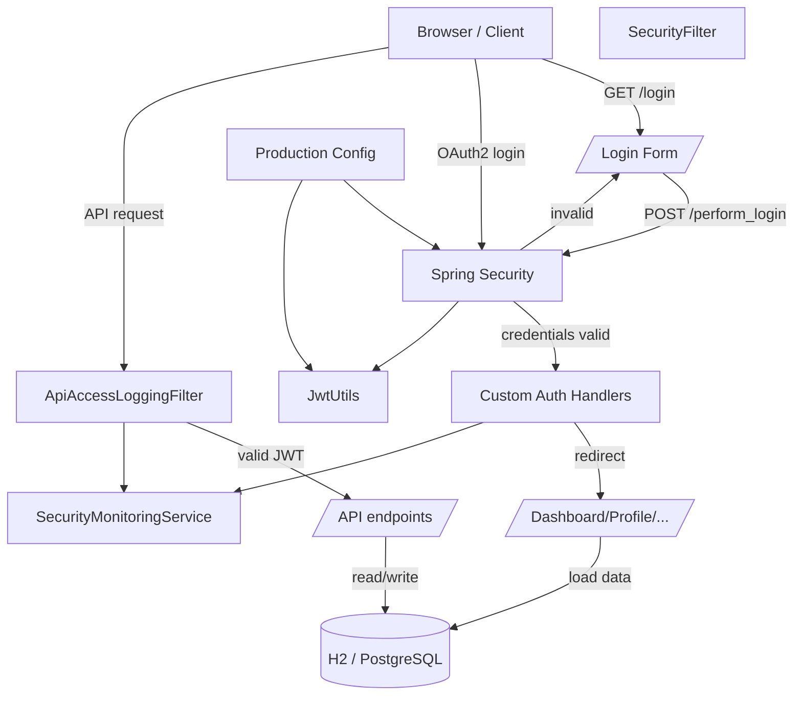

# NeSL Spring Demo

A Spring Boot web application that demonstrates a full-stack Java web workflow using:

- JSP pages for user interface
- Spring Security for login, OAuth2, and JWT authentication
- H2 in-memory database for development
- JPA repository access for user accounts
- Custom security logging and monitoring

## What this project does

This project allows users to log in via a normal form or OAuth2, then access protected pages and API endpoints. It also tracks login attempts and API access events, and supports a production profile with stronger security settings.

## Architecture overview

The application is structured into these major layers:

- `controller` - handles web requests and returns JSP views or JSON responses
- `security` - configures Spring Security, JWT handling, filters, and login hooks
- `service` - contains business logic and monitoring functions
- `repository` - stores user data in the database
- `model` - defines the `UserAccount` entity

## Flow diagram



## How everything works (easy words)

### 1. User visits the app

A user opens the app in a browser and sees the login page. If they are already logged in, they can go to pages like dashboard or profile.

### 2. User logs in

- The form submits username and password to `/perform_login`.
- Spring Security checks those credentials against the database.
- If login succeeds, a custom success handler records the login and redirects the user to `/dashboard`.
- If login fails, a custom failure handler records the failed attempt and sends the user back to `/login?error=true`.

### 3. OAuth2 login

Users can also use Google OAuth2 if configured. The OAuth2 flow is managed by Spring Security and lets users sign in with their Google account.

### 4. JWT and APIs

For API access, the app uses JWT tokens.

- `JwtUtils` creates and validates tokens.
- `AuthTokenFilter` checks incoming requests for a token and loads the user if it is valid.
- `ApiAccessLoggingFilter` records access to API endpoints.

### 5. Data storage

By default, the app uses an in-memory H2 database for development. This means data is stored in memory while the app runs and is lost when the app stops.

In production, configuration can switch to PostgreSQL and enable stronger SSL and logging settings.

### 6. Security rules

The app protects pages and endpoints with these rules:

- public pages like `/`, `/login`, and static resources are open to everyone
- `/api/auth/**` is open so login and token refresh endpoints work
- `/api/**` requires a valid JWT token
- `/users/**` requires a user with role `ADMIN` or `MANAGER`
- all other pages require login

## Important files

- `src/main/java/com/example/Spring_Demo/SecurityConfig.java` - main security setup
- `src/main/java/com/example/Spring_Demo/security/JwtUtils.java` - token handling
- `src/main/java/com/example/Spring_Demo/security/AuthTokenFilter.java` - JWT request filter
- `src/main/java/com/example/Spring_Demo/security/ApiAccessLoggingFilter.java` - logs API access
- `src/main/resources/application.properties` - local development settings
- `src/main/resources/application-production.properties` - production settings

## Run the app

### Development

```bash
.\mvnw clean package
.\mvnw spring-boot:run
```

### Windows

```powershell
.\mvnw.cmd clean package
.\mvnw.cmd spring-boot:run
```

## Configuration notes

### Development config

`src/main/resources/application.properties` is the default file for local development.

- uses H2 in-memory database
- SSL is disabled locally
- logging is enabled for easier debugging

### Production config

`src/main/resources/application-production.properties` contains:

- PostgreSQL connection settings
- SSL keystore configuration
- stricter logging settings
- actuator endpoint exposure settings

## What to look at next

If you want to extend the app, consider these improvements:

- add registration and password reset flows
- use a real database for production
- improve JWT refresh and expiration handling
- add more user roles and permissions
- add a frontend framework for a richer UI
